# 知行天气
## 软件简述

### 编写目的

当今市面上所有款式的天气预报APP界面美观，数据详实，但是或多或少都会有广告，很多用户都有不小心点到广告后后台自动下载的糟糕经历。从Android开发者的角度来说，这种利益诉求当然可以被理解。但是不可置否的是这将严重影响用户体验，降低用户黏度。此外，与市面上所有其他天气系统不同，本系统主要以地图定位功能为特色，帮助用户对自己当前的位置与天气预报中的天气情况所在地的相对距离做出更直观的理解，使用户不过于依赖天气预报，也不会因为位置偏差而认为其不准确，能够更好地对将要到来或者离去的雨雪等天气做好防范和准备。对于出行旅游的用户来说，这个功能无疑是锦上添花，使用户不必再打开地图查看所在位置，直接就可以获取当地天气，非常便利。究其根本，本系统旨在为客户提供既简洁，又无广告的用户友好型天气预报产品。

### 功能及特点

本系统取名为知行天气，意为知位、随行，既方便用户随时随地获取当地天气信息及其所在市县定位，系统的地图定位又可以让用户便捷地获取自己的位置信息。另外，知行意为知行合一，是王阳明先生提出的“知道”与“做到”的学问。本系统也算一个有文化底蕴的中华天气预报系统了。

## 软件启动

应用安装完成后，点击应用图标，，即可进入主页面使用app，进入应用后，首先选择要查看天气的城市：依次选择省、市、县，在选择市和县的时候，都可以点击左上角的返回按钮返回上级选择列表.

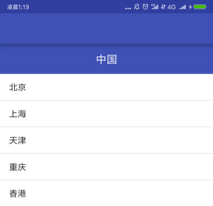

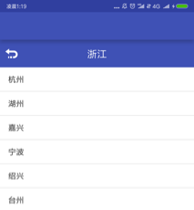

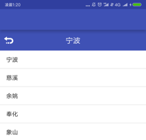

## 授予权限

选择完成后，用户还需要允许应用权限，权限总共三项，一项一项允许后才可以进入主页面，否则系统会自动退出.

​     									图2-4 三项必须允许的权限

## 查看天气

三项权限允许之后，就可以查看天气状况了。本系统设计了包括城市定位、空气质量、实况天气、未来三天预报和生活建议几个模块。其效果分别如下：

 

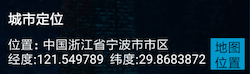

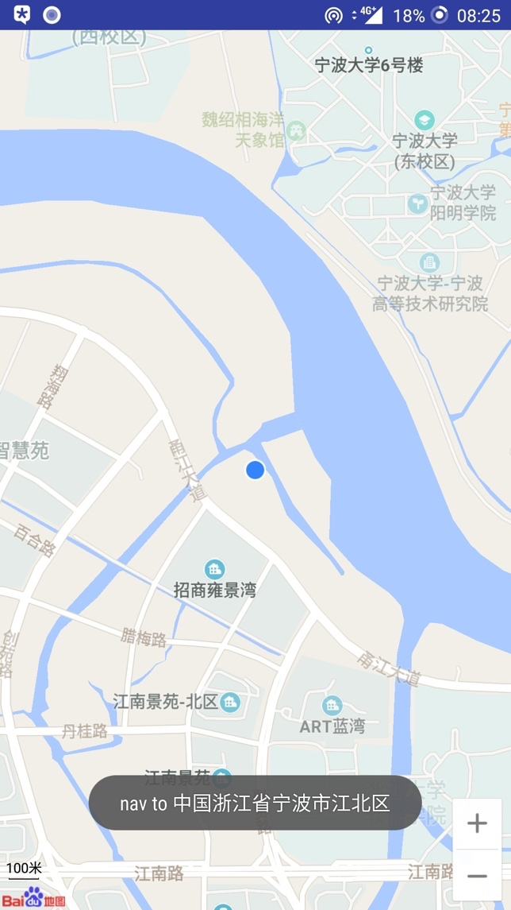

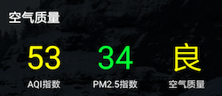

## 菜单功能

点击右上角的菜单按钮，会出现如下菜单，分别对应的功能为自动定位功能，地图定位功能和查询城市.

点击自动定位，系统会给用户切换提示，并自动为用户切换显示用户所在城市的天气状况.

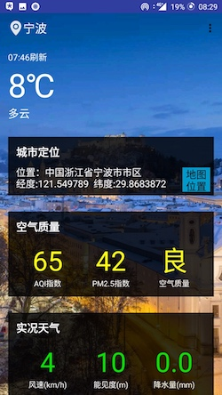

点击地图定位，系统会调用百度地图(**用户无需下载百度地图**)为用户显示用户当前所在地区的地图信息与用户的具体位置。

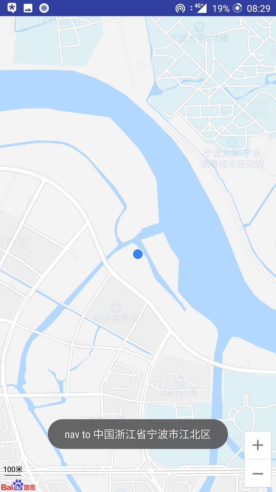

点击查找城市，系统会弹出对话框邀请用户输入用户要查找的城市，输入完毕，点击确认之后，若用户输入的城市有误，系统会为用户提示，用户可以再次使用查找功能；若用户输入城市无误，则系统自动为用户切换到用户所查找的城市的天气。

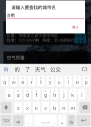

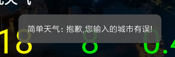

## 右滑选择城市

在本软件中，用户可以在天气显示界面中右滑进入选择城市的界面，该界面和之前一开始进来的界面功能相似，用户可以直接在这里选择目的城市.

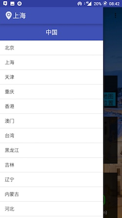

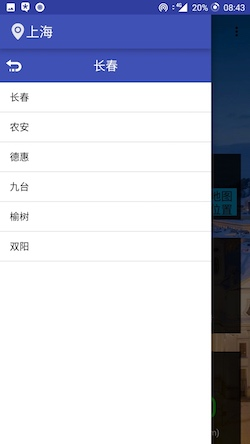

  